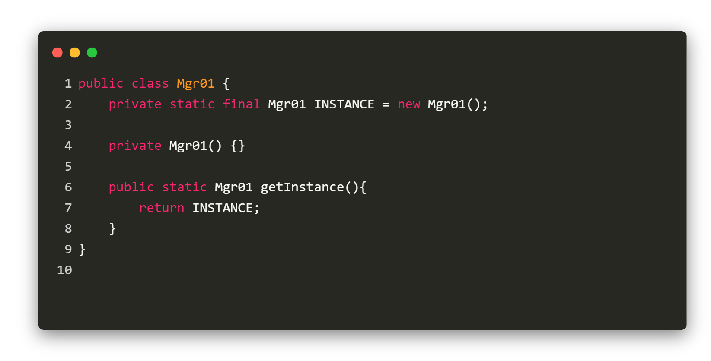
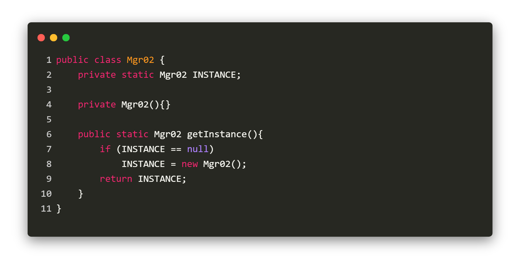
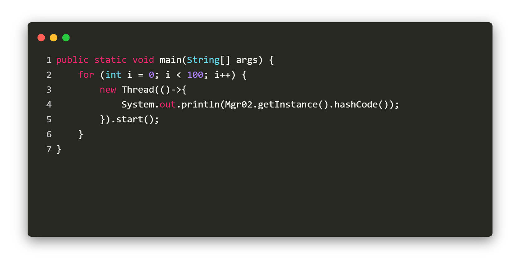
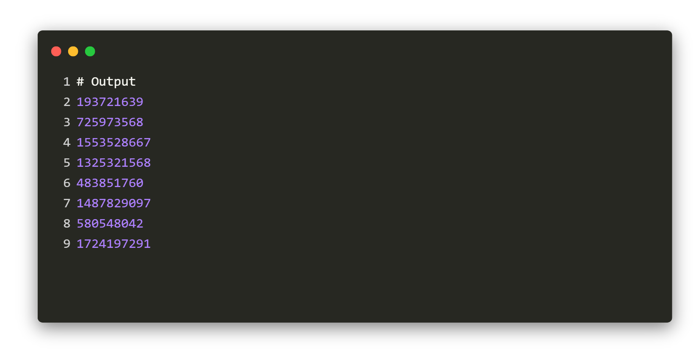
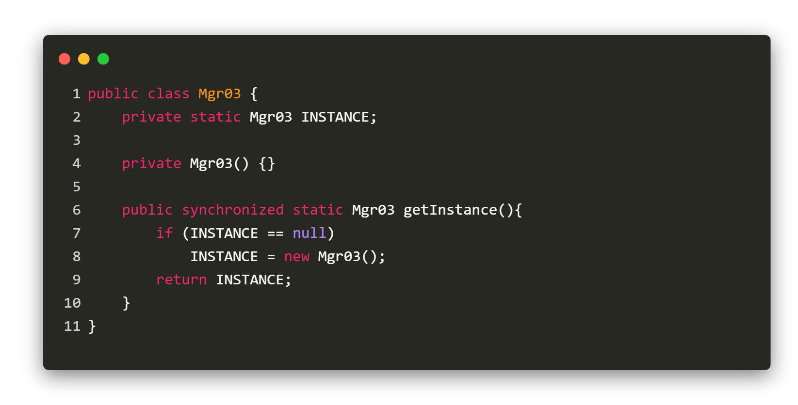
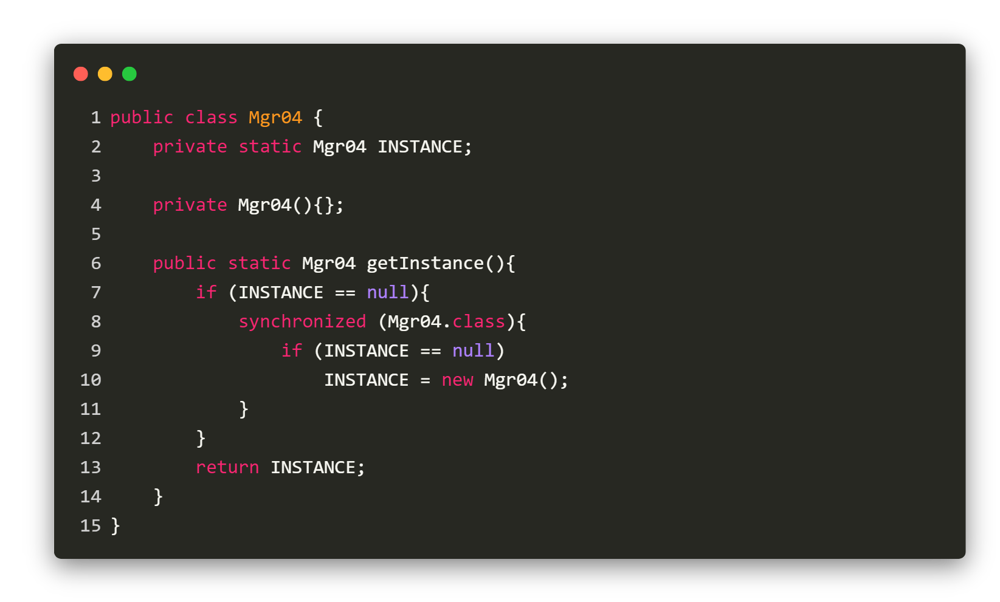
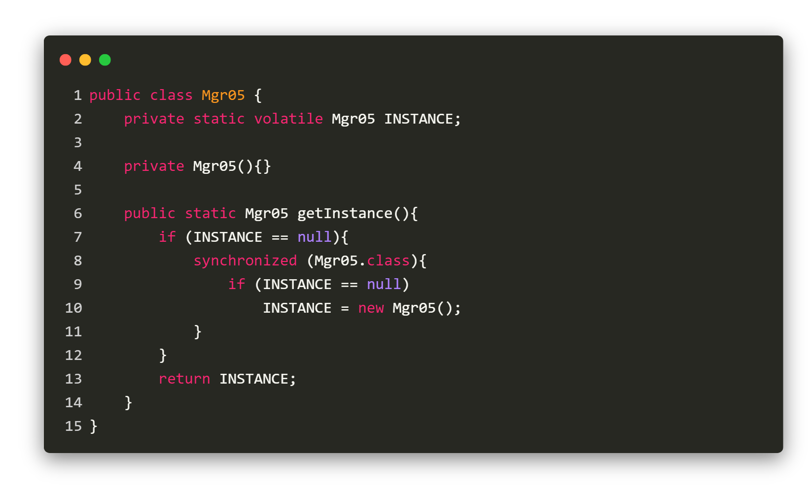
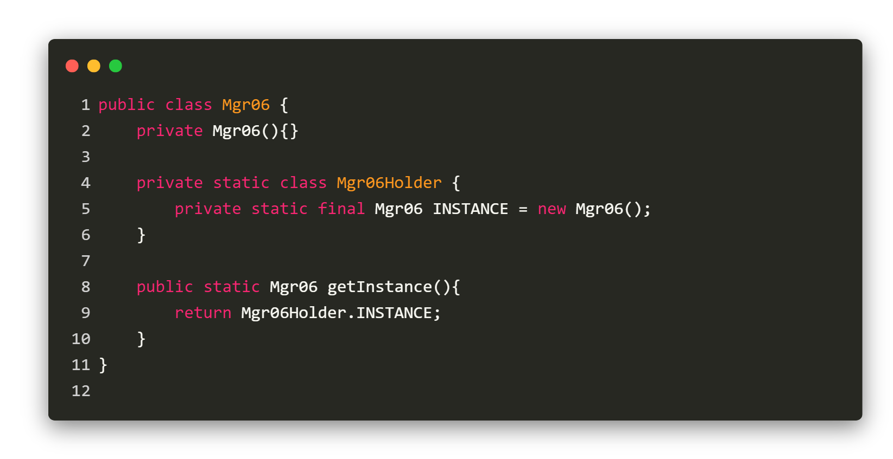
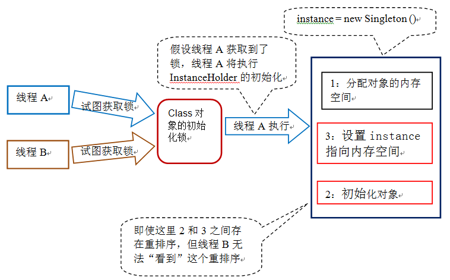
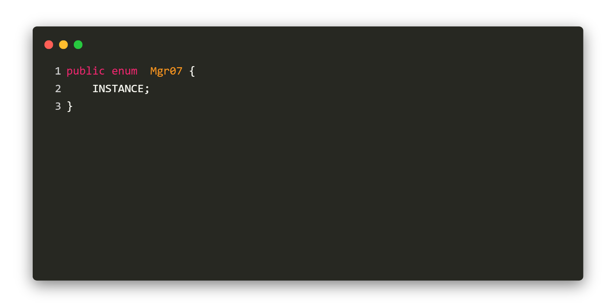

### 饿汉式

<div>
    
</div>

**特点**
- 类加载到内存后，就会生成一个对象单例

**优点**
- Class 只加载一次到内存，JVM 保证线程安全
- 简单实用

**缺点**
- 不管用到与否，类加载后都会实例化

### 懒汉式（线程不安全）
<div>
    
</div>

**特点**
- 类加载到内存后，并不会立即生成一个对象单例
- 当需要使用 INSTANCE 时，才会调用 getInstance() ，无则新建，有则返回

**优点**
- 需要时才会实例化单例对象

**缺点**
- 多线程时产生线程不安全问题

|Time|Thread A|Thread B|
|---|---|---|
|T1|检查到INSTANCE为空| |
|T2| |检查到INSTANCE为空|
|T3| |初始化对象A|
|T4| |返回对象A|
|T3|初始化对象B| |
|T4|返回对象B| |

测试可以发现，多个线程访问 getInstance() 后 INSTANCE 并非单例:
<div>
    
    
</div>

### 懒汉式（线程安全）

<div>
    
</div>

**特点**
- 对 getInstance() 做了同步处理

**优点**
- 线程安全

**缺点**
- synchronized 将导致性能开销
- 如果 getInstance() 被多个线程频繁的调用，将会导致程序执行性能的下降

### 错误的双重检查锁（double checked locking）

<div>
    
</div>

**错误**
- 在线程执行到第 7 行代码读取到 INSTANCE 不为 null 时，INSTANCE 引用的对象有可能还没有完成初始化

第 10 行代码创建一个对象。这一行代码可以分解为如下的三行伪代码：

```
memory = allocate();    // 1: 分配对象的内存空间 
ctorInstance(memory);   // 2: 初始化对象 
INSTANCE = memory;      // 3: 设置 instance 指向刚分配的内存地址
```

上面三行伪代码中的 2 和 3 之间，可能会被重排序（在一些 JIT 编译器上，这种重排序是真实发生的）。2 和 3 之间重排序之后的执行时序如下：

```
memory = allocate();    // 1: 分配对象的内存空间
INSTANCE = memory;      //3：设置 instance 指向刚分配的内存地址 
                        // 注意，此时对象还没有被初始化！
ctorInstance(memory);   // 3： 初始化对象
```

这个重排序在没有改变单线程程序的执行结果的前提下，可以提高程序的执行性能（利用到寄存器中已有的值就不用去内存读取），但是会破坏多线程的执行语义。

|Time|Thread A|Thread B|
|---|---|---|
|T1|分配对象的内存空间| |
|T2|设置 INSTANCE 指向内存空间 | |
|T3| |判定 INSTANCE 是否为null|
|T4| |线程 B 初次访问对象|
|T3|初始化对象| |
|T4|线程A初次访问对象| |

当线程 A 和 B 按上图的时序执行时，B 线程将看到一个还没有被初始化的对象。

### 正确的双重检查锁（double checked locking）

<div>
    
</div>

**特点**
- 当声明对象的引用为 volatile 后，重排序在多线程环境中将会被禁止

**优点**
- 如果第一次检查 instance 不为 null，那么就不需要执行下面的加锁和初始化操作。因此可以大幅降低 synchronized 带来的性能开销
- 保证线程安全的延迟初始化

### 静态内部类方式

<div>
    
</div>

**特点**
- JVM 在类的初始化阶段（即在 Class 被加载后，且被线程使用之前），会执行类的初始化。在执行类的初始化期间，JVM 会去获取一个锁。这个锁可以同步多个线程对同一个类的初始化
<div>
    
</div>

**优点**
- 第一次加载 Mgr06 类时并不会初始化 INSTANCE 单例，只有第一次调用 getInstance 方法时 JVM 加载 Mgr06Holder 并初始化 INSTANCE，保证Singleton类的唯一性
- 确保线程安全

### 枚举单例
<div>
    
</div>

**优点**
- 简单，但是大部分应用开发很少用枚举，可读性并不是很高
- 防止反序列化（将一个单例实例对象写到磁盘再读回来，从而获得了一个实例）
- 线程安全的，并且在任何情况下都是单例

### 参考资料

[双重检查锁定与延迟初始化](https://www.infoq.cn/article/double-checked-locking-with-delay-initialization/#anch136785)
[Java中的双重检查锁（double checked locking）](https://www.cnblogs.com/xz816111/p/8470048.html)